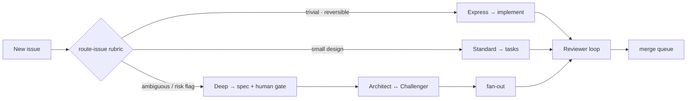
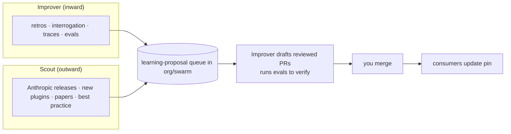

# Dev Swarm — Master Build Spec

*The original design and rationale for the swarm. It supersedes the four earlier design docs (concept, implementation, adversarial, reuse/scanning), merged and deduplicated here.*

> **Status: implemented (v0.1.0).** The build described here exists in this repo.
> This document is retained as the **design rationale** and as the anchor for the
> `§`-references used throughout the agents, skills, and docs — the conceptual
> model below is still accurate. For **how to use** the swarm, see the
> [README](README.md). For **what changed or was decided during/after the build**,
> see the **[Addendum](#addendum--status--decisions-since-v010)** at the end and the
> ADRs in [`docs/decisions/`](docs/decisions/).
>
> **Naming:** the placeholder `org/swarm` below is the real repo
> **`evanda/agent-swarm`**; the illustrative JSON (owner email, repository URL) was
> realized with actual values in the committed `marketplace.json` / `plugin.json`.

**Read order:** skim §1 for intent; §2–§12 are the design; §13 was the build order
(now done — see the Addendum for status); the Addendum records decisions since.
Names in **bold** are canonical — they match the agent/skill files verbatim.

---

## 1. Concept & principles

A persistent **Orchestrator** you talk to (in Claude Code) reads work from **GitHub Issues**, routes each item into one of three **lanes** by risk/ambiguity, and delegates to **ephemeral, single-purpose subagents** that each run in their own context window and return only a condensed result. Every generative agent has a **paired adversary** that iterates with it. **GitHub itself** is the control plane, merge queue, paper trail, and checkpoint mechanism — none of it is rebuilt. The system improves from **two inflows**: an **Improver** looking inward (retros, interrogation, traces) and a **Scout** looking outward (state-of-the-art tooling). It is **one engine with swappable cartridges** — orchestration is stack-agnostic; per-repo skills/MCP/constitution carry Android-vs-web-vs-enterprise specifics.

Non-negotiable principles (these are also the seed of `constitution.md`):

1. **Two human surfaces only:** GitHub Issues (async, durable) and Claude Code (sync, interactive). Everything else is internal plumbing.
2. **The Orchestrator delegates; it never writes code.** It plans, decomposes, synthesizes.
3. **Context isolation is the efficiency mechanism.** Heavy reading/searching/diffing happens in subagents that return summaries.
4. **Match effort to complexity — short-circuit aggressively.** Parallel fan-out costs ~an order of magnitude more tokens; reserve it for genuinely decomposable work.
5. **Generation and verification are always separate agents on different models.** Self-review is overconfident; same-model pairs collude.
6. **State lives in Git, not in agents.** Agents are cattle; issues/PRs/ADRs/learnings are permanent.
7. **Every run is instrumented.** Without traces, self-improvement can't verify itself.
8. **The system edits its own scaffolding** only through reviewed PRs — never silent edits, never auto-merge.
9. **Minimize the DIY surface.** Depend on external tooling by default; own only genuine differentiators.

---

## 2. The agents (role spine)

Each agent = focused expertise + its own scoped context/tools. The hot path is four roles; the rest are support, periodic, or adversaries. Create one file per role in the plugin's `agents/`.

| Agent file | Role | Runs as | Model | Job | Must NOT |
|---|---|---|---|---|---|
| `orchestrator.md` | **Orchestrator** | main session / team lead | Opus-class | triage → route → decompose → delegate → synthesize; owns the issue graph | write production code; hold raw search/diff output |
| `explorer.md` | **Explorer** | subagent (read-only) | fast | recon a codebase/question; return a distilled map | carry raw findings to the main thread |
| `architect.md` | **Architect** | subagent | Opus-class | turn an ambiguous issue into spec→plan→tasks; **record decisions + rejected alternatives** | implement |
| `challenger.md` | **Challenger** | subagent (≠ Architect's model) | Opus-class | attack the spec before fan-out: ambiguity, edge cases, hidden assumptions, cheaper alternatives, risk | rewrite the spec (it critiques; Architect revises) |
| `implementer.md` | **Implementer** | subagent in a worktree | mid/Sonnet-class | do exactly one task → one PR; **record decisions** | review own PR; touch another task |
| `reviewer.md` | **Reviewer** | subagent (≠ Implementer's model) | mid/Sonnet-class | iterative independent verification vs checklist + spec | author the fix |
| `integrator.md` | **Integrator** | subagent | fast | resolve conflicts; drive the merge queue | bypass required checks |
| `scribe.md` | **Scribe** | subagent + Stop hook | fast | paper trail, follow-up issues, ADRs, emit learning-proposals | make product decisions |
| `improver.md` | **Improver** | scheduled job in `swarm` | Opus-class | inward loop: retros, interrogation, evals → reviewed PRs | auto-merge its own PRs |
| `scout.md` | **Scout** | scheduled job in `swarm` | Opus-class | outward loop: scan SOTA tooling → scorecard proposals | adopt anything without a reviewed PR |

Subagents that edit files need the parent to handle approval prompts — keep **Explorer/Challenger/Reviewer read-only** (omit Edit/Write from their `tools:`) and let **Implementer/Integrator** do writes in their worktree.

**Borrow, don't start blank:** seed Explorer/Architect/Reviewer from Anthropic's official `feature-dev` and `pr-review-toolkit` plugins (in `anthropics/claude-code`); seed skill authoring from `skill-creator@claude-plugins-official`.

---

## 3. The lanes & the router

At intake the Orchestrator runs the **`route-issue`** skill (a conservative risk rubric) and stamps a lane label. *When uncertain, escalate a lane up.*

| Lane | Trigger | Flow | Design dialectic | Code dialectic | Red-team |
|---|---|---|---|---|---|
| **Express** | bounded blast radius, reversible, tests exist, single component, **no** risk flag | implement → light review → merge | none | single pass, 1 round | no |
| **Standard** | clear intent, small design | tasks → implement → review → merge | none (unless risk flag) | Reviewer loop, cap 2 | no |
| **Deep** | ambiguous / cross-cutting / risk flag | spec→plan→tasks + **human gate** → fan-out → review → integrate | Architect ↔ Challenger, cap 2, before fan-out | Reviewer loop per PR, cap 3 | if any risk flag |

**Risk flags that force Deep (or a human) regardless of apparent size:** `risk:auth`, `risk:money`, `risk:data` (migrations/schema), `risk:api` (public contract), `risk:destructive`, secrets/credentials. Adversarial depth is set automatically by lane/risk — wire this table into `route-issue`.



---

## 4. The control plane: GitHub (reuse, don't rebuild)

| Concern | GitHub primitive |
|---|---|
| Intake & tracking | **Issues** (the only thing the human files) |
| Task breakdown | **Sub-issues** (one per delegatable unit) |
| Spec/plan/tasks artifacts | markdown in `specs/<issue-id>/`, linked from the issue |
| Parallel isolation | **git worktrees** (one per Implementer) |
| Review surface | **Pull Requests** + review comments |
| Merge serialization | **GitHub merge queue** + branch protection (the "Refinery," for free) |
| Quality gates | required status checks + **CODEOWNERS** |
| Human checkpoints | required reviews, draft PRs, `needs-human` label |
| Paper trail | issue/PR/commit history + ADRs in `docs/decisions/` + `.swarm/run-log.jsonl` |
| Next steps | new Issues filed by the Scribe |

Mental model: **Issue = intent; sub-issue = delegatable task; PR = verified change; label = routing/status signal.** The Orchestrator just moves items through that graph.

---

## 5. The central repo: `org/swarm`

One repo that is simultaneously the **marketplace**, the **plugin**, and the **knowledge base**.

```
swarm/
├── .claude-plugin/marketplace.json        # catalog (§5.1)
├── plugins/swarm/
│   ├── .claude-plugin/plugin.json         # manifest (§5.2)
│   ├── agents/                            # the 10 agents (§2)
│   ├── skills/                            # one dir per skill, each SKILL.md (§6)
│   ├── hooks/hooks.json                   # minimal global hooks (§6, §10)
│   ├── commands/                          # /swarm:start, /swarm:express, /swarm:retro (entry points)
│   └── .mcp.json                          # shared MCP defaults (github, etc.)
├── knowledge/
│   ├── constitution.md                    # shared non-negotiables + risk flags
│   ├── learnings.md                       # accumulated lessons (inward)
│   ├── dependencies.md                    # the divergence ledger (§8)
│   ├── scout-sources.md                   # curated external sources (§8)
│   └── evals/                             # golden tasks per archetype (android/web/enterprise)
├── .github/
│   ├── ISSUE_TEMPLATE/learning-proposal.md
│   └── workflows/
│       ├── validate-plugin.yml            # lint marketplace/plugin on PR
│       ├── improver.yml                   # nightly inward loop (§8)
│       └── scout.yml                      # weekly outward loop (§8)
└── README.md
```

Keep all plugin folders **inside this repo** with relative `./plugins/swarm` sources (private-repo external sources aren't fetchable by the org-sync path). Set `GITHUB_TOKEN` where a private marketplace must auto-update.

### 5.1 `.claude-plugin/marketplace.json`
```json
{
  "name": "swarm",
  "owner": { "name": "Evanda", "email": "you@remingtons.org" },
  "metadata": { "description": "Central dev-swarm brain: agents, skills, hooks." },
  "plugins": [
    { "name": "swarm", "source": "./plugins/swarm",
      "description": "Orchestrator + role agents, skills, hooks for the dev swarm.",
      "category": "development" }
  ]
}
```
### 5.2 `plugins/swarm/.claude-plugin/plugin.json`
```json
{
  "name": "swarm", "version": "0.1.0",
  "description": "Dev swarm: orchestrator and specialized role agents, skills, and guardrail hooks.",
  "author": { "name": "Evanda" },
  "repository": "https://github.com/org/swarm", "license": "MIT"
}
```
Bump `version` on every meaningful change; consumers pin to it.

---

## 6. Skills, hooks, MCP — the layering

Each primitive solves a different problem; don't duplicate across them. Canonical decomposition: **MCP** fetches (GitHub PR), a **skill** carries methodology (review checklist), a **subagent** runs it in isolation.

**Skills** (`skills/<name>/SKILL.md`; the `description` is the trigger — make it specific). Author:
`route-issue`, `review-checklist`, `spec-plan-tasks` (wraps Spec Kit: constitution→specify→plan→tasks→clarify), `dialectic` (the §7 protocol + critique schema), `red-team` (risk-mode checklist), `interrogate` (§8 cross-examination), `retro`, `promote-learning` (§9 routing), `scout-scan` (§8 scorecard), `eval-dependency`, `write-adr`, `release-android`, `release-web`.

**Hooks** (`hooks/hooks.json`) — *keep the global set minimal* (see §10 for why). Recommended globally-registered: a `PreToolUse` secrets/destructive-op guard only. All other automation (run-log on `Stop`, learnings-load on `SessionStart`, proposal-flush) lives **inside the swarm agents/skills** so it runs only under `/swarm:*`, not in plain sessions. If you want lint-on-edit always-on, add a `PostToolUse` hook — but know it fires in plain sessions too.

**MCP** (`.mcp.json`, keep the count low — more skills than servers is healthy): **GitHub MCP** (backbone), **Supabase/Postgres**, **Playwright/browser** (E2E + screenshots), **OpenTelemetry/Sentry** (traces for Reviewer + Improver). Release steps are better as scripts invoked by `release-*` skills than full servers.

**Always-on context:** a short `constitution.md` + a lean `CLAUDE.md` that mostly *points at skills*.

---

## 7. Adversarial layer

Every generator has an adversary that **iterates** with it (not a one-shot gate).

**Pairings:** Architect ↔ **Challenger** (design); Implementer ↔ **Reviewer** (code); every agent ↔ **Improver** (retrospective interrogation).

**Iteration protocol** (`dialectic` skill): the adversary emits a structured critique — each item **blocker / concern / nit** with rationale. The generator must address **every blocker and concern** (revise *or* rebut with reasoning); the adversary must **engage rebuttals**, not re-assert. Loop until objective convergence (blockers cleared, tests green, risk addressed) or the turn cap; deadlock → escalate.

**Anti-sycophancy (or it's theater):** adversary on a *different model*; prompt requires stating the strongest objection and steelmanning the alternative (agreeableness is failure); adversary never authors the fix. The Improver tracks **rubber-stamp rate**, **false-block rate** (use confidence scoring to filter false positives, à la `pr-review-toolkit`), and **deadlock rate**.

**Deadlock** is a signal: the Orchestrator surfaces both positions + the crux to a human, or invokes a one-shot **Judge** (independent third model, ruling only) for low-stakes ties. High-risk ties always go to a human.

---

## 8. Self-improvement — two inflows



**Inward (Improver, nightly `improver.yml`):** reads open `learning-proposal` issues, applies edits to the target skill/constitution/learnings/eval, **runs `knowledge/evals` to confirm no regression**, groups related changes, opens **one PR** linking the proposals, bumps `plugin.json` version. Runs sampled **interrogations** (weighted to bad outcomes/low-confidence/risk) using the decision records that Architect/Implementer log. Never auto-merges.

**Outward (Scout, weekly `scout.yml`):** scans `knowledge/scout-sources.md` (Anthropic news/changelog/docs, `anthropics/claude-code`, `claude-plugins-official`, `anthropics/skills`, `github/spec-kit` releases, key practitioners) plus targeted searches for each `revisit_if` trigger in the ledger. For each finding, a **scorecard** — Fit / Maturity / Maintenance-delta (how much DIY it lets you delete) / Portability-lock-in / Migration-cost-&-reversibility / Risk → verdict **Adopt / Adapt / Watch / Pass**. Adopt/Adapt or a tripped trigger (→ propose **Retire**) is filed as an `external`-labeled proposal into the same queue. **Anti-thrash:** Watch is the default for immature things; require a maturity bar; weight reversibility/portability.

**The divergence ledger** (`knowledge/dependencies.md`) — the watch-list that makes "replace DIY with best practice" tractable. One row per capability:
```yaml
- capability: code-review
  posture: adapt
  upstream: anthropics/pr-review-toolkit@v1.4.0
  delta: "Added our severity schema + iterative loop."
  revisit_if: "pr-review-toolkit adds native multi-round iteration → drop our wrapper."
- capability: lane-router
  posture: author
  upstream: null
  delta: "No external tool routes by our risk rubric."
  revisit_if: "An external risk-aware triage router appears."
```
Every **Adapt/Author** row must carry a `revisit_if`; **Adopt** rows carry a pin.

---

## 9. Routing improvements: two orthogonal tags

Every improvement is tagged on two axes before its PR; both land in the same reviewed queue.

**(a) WHERE — shared `swarm` vs a project repo.** Core question: *would this rule be true in a different project of a different type?* Three litmus tests in `promote-learning`:
1. **Portability** — want it in a brand-new unrelated project? → shared.
2. **Stack** — names a framework/file/service/schema/domain term unique to this repo? → project.
3. **Class** — can you name the general failure *class*? the class rule → shared; the instance may leave a local note.

**Split is common:** general principle → shared, local application → project (e.g. *"verify external API contracts in tests"* shared; *"our webhook sends cents not dollars"* local). **Defaults:** ambiguous → shared **proposal** (reviewed; downgradable); never push a stack-specific rule to shared (pollutes every repo's context). Lessons **start in `learnings.md`** and harden into a skill/constitution only after they recur.

**Layer** (orthogonal): non-negotiable → constitution(.delta); procedure → skill; convention → CLAUDE.md; tentative → learnings.md.

**(b) POSTURE — Adopt / Adapt / Author / Retire** (§8). Set by the Scout for external findings.

**Deviation mechanics** (how to layer deltas accurately — they differ by primitive):

| Primitive | Override behavior | How you deviate |
|---|---|---|
| MCP servers | override **by name** (local > project > user) | redefine at a higher scope |
| settings/permissions | merge; managed > local > project > user | add higher-scope key |
| hooks | all fire (no override) | add yours alongside |
| CLAUDE.md | `CLAUDE.local.md` extends/overrides | put deltas there (⚠ reliable on CLI/headless; inconsistent on claude.ai web/mobile) |
| **bundled** skills | same-name project/user skill **overrides** | drop same-named skill in `.claude/skills/` |
| **plugin** skills | **namespaced — no override-by-name today** | (1) point agents at your `/swarm:*` skill, optionally calling upstream internally; or (2) **vendor just that one skill** into `swarm` and own it — never fork the whole plugin; record in the ledger |

Pin all upstream by `ref`/`sha` so nothing changes behavior until you vet and bump.

---

## 10. Activating, invoking & opting out in existing projects

**Design intent: the swarm installs DORMANT.** It is *available* in a repo once activated, but *nothing swarm-related fires* until you explicitly summon it. A plain `claude` session in an activated repo is 100% normal. This works because of two rules, both enforced in the plugin:
- **Entry skills are explicit-only:** `/swarm:start`, `/swarm:express`, `/swarm:retro` carry `disable-model-invocation: true`, so Claude can never auto-trigger them — only you, by typing the command.
- **No swarm skill auto-triggers from natural language, and the plugin registers no broad global hooks.** Operational skills are invoked *by swarm agents* (which only run under an entry command), not matched against your prompts. Keep operational skills `user-invocable: false` (agent-invoked, hidden from the `/` menu) with narrow descriptions.

### A. Activate (one-time per existing project)
1. Commit `.claude/settings.json` registering the marketplace, pinned:
```json
{ "extraKnownMarketplaces": {
    "swarm": { "source": { "source": "github", "repo": "org/swarm", "ref": "v0.1.0" } } } }
```
2. Install the plugin **at project scope** (records the enable in `.claude/settings.json` so it travels with the repo, including fresh cloud clones):
```
/plugin install swarm@swarm     # choose "project" scope
/reload-plugins
```
3. Add `.swarm/config.json` → `{ "central_repo": "org/swarm" }`, a thin `CLAUDE.md`, and `constitution.delta.md`.

The repo is now swarm-ready but dormant.

### B. Invoke (when you want the swarm)
- **Interactive (Claude Code):** type an entry command.
  - `/swarm:start <issue#-or-description>` → Orchestrator triages, routes, runs the lane.
  - `/swarm:express <description>` → force the Express lane for a known-trivial fix.
  - `/swarm:retro` → run a retrospective on recent work.
- **Async (GitHub):** file or assign an Issue and apply a `lane:*` (or just `triage`) label; the scheduled/triggered job picks it up. No Claude Code session needed.

### C. Don't invoke (plain, non-swarm session)
- Just run `claude` and work normally. Don't type `/swarm:*`. Because entry skills are explicit-only and nothing else auto-fires, you get a vanilla Claude Code session — the `/swarm:*` commands simply sit unused in the menu.
- **Verify nothing auto-loads** (optional): run `/doctor` to see what skills are listed/triggering. To fully hide the commands in a given repo, `/plugin` to disable, or set the entries to `"name-only"`/`"off"` via `skillOverrides` in that repo's settings — normally unnecessary.
- **Reassurance rule of thumb:** *no `/swarm:` typed = no swarm.*

> If you want the secrets/destructive-op **guard hook** active even in plain sessions, that's the one thing to register globally (§6). Everything else stays behind the entry commands. This is a deliberate choice — decide it at build time.

---

## 11. Consumer repo footprint

Small, committed, so even a fresh cloud clone is fully wired:
```
my-app/
├── .claude/settings.json       # extraKnownMarketplaces + project-scope plugin install (pinned)
├── .swarm/config.json          # { "central_repo": "org/swarm" }
├── CLAUDE.md                   # thin repo conventions; "swarm available via /swarm:start"
├── constitution.delta.md       # repo-specific overrides
├── specs/                      # Deep-lane artifacts
└── docs/decisions/             # ADRs
```
**From the plugin (read-only, namespaced):** all agents, universal skills, the minimal global hook, shared MCP defaults. **Local to the repo:** `constitution.delta.md`, thin `CLAUDE.md`, any repo-only skills in `.claude/skills/` (these coexist with plugin skills), and the cartridge choice (which `release-*` applies). Universal improvements route back to `swarm` (§9); repo-specific ones stay here.

---

## 12. Permissions, cost & safety

- **Tokens:** consumer environments need a GitHub token with `issues:write` (+ `pull-requests:write` for repo-local fixes) on both the consumer repo and `org/swarm`; `GITHUB_TOKEN` for private-marketplace auto-update. The `improver.yml`/`scout.yml` jobs need `contents/pull-requests/issues: write` on `swarm` and `ANTHROPIC_API_KEY`.
- **Pinning is the adoption boundary:** central churns; each consumer bumps `ref`/`sha` when ready (enterprise repos pin to tags).
- **Cost:** per-issue budget caps with auto-escalation; Express-lane-first economics; cheaper subagents via `CLAUDE_CODE_SUBAGENT_MODEL` (Opus main + Sonnet/Haiku workers); adversarial depth scales with lane (§3).
- **Claim-before-work:** an Implementer assigns itself the sub-issue before starting — the GitHub issue is the lock against duplicate work.
- **Hard guards:** `PreToolUse` denials for `rm -rf`, force-push to protected branches, secret-bearing diffs, edits outside the active worktree. No standing prod credentials to agents; production access stays behind a human checkpoint.
- **The brain changes only via reviewed PRs** — Improver and Scout propose; you merge.

---

## 13. Build order

Each rung is useful standalone; don't build the whole factory first.

1. **Central skeleton:** `org/swarm` with §5 layout, `marketplace.json`, `plugin.json`, stub `constitution.md`, `validate-plugin.yml`.
2. **Conventions + routing:** `route-issue`, `review-checklist`, `constitution.md`.
3. **Review split:** `orchestrator.md`, `implementer.md`, `reviewer.md` (different model) + the entry commands (`/swarm:start`, `/swarm:express`) with `disable-model-invocation: true`.
4. **Activate one real repo** (§10A), run an issue through Express + Standard end to end, and **confirm a plain `claude` session stays dormant** (§10C).
5. **Deep lane + design dialectic:** Spec Kit, `spec-plan-tasks`, the spec human-gate, `architect.md`, `challenger.md`, `dialectic`, `red-team`.
6. **Paper trail + proposals:** `scribe.md`, `write-adr`, the minimal global guard hook, decision-record logging, `learning-proposal` template, `.swarm/config.json`.
7. **Inward loop:** `evals/`, `learnings.md`, `improver.yml`, `improver.md`, `interrogate`, `promote-learning`.
8. **Outward loop:** `dependencies.md`, `scout-sources.md`, `scout.yml`, `scout.md`, `scout-scan`, `eval-dependency`.
9. **Parallelism + cartridges:** worktree-based parallel Implementers with claim-before-work; `release-android` / `release-web`; package other repos by copying the §11 footprint.

---

## Appendix — shared label taxonomy
- **Lane:** `lane:express` · `lane:standard` · `lane:deep`
- **Risk:** `risk:auth` · `risk:data` · `risk:api` · `risk:money` · `risk:destructive`
- **Status:** `triage` · `spec-review` · `in-progress` · `in-review` · `needs-human` · `blocked`
- **Improvement:** `learning-proposal` · `external` (Scout) · `retire-candidate` · `meta` (Improver PRs)

---

## Addendum — status & decisions since v0.1.0

What was built, and the decisions that refined the design above. Each decision of
weight has an ADR in [`docs/decisions/`](docs/decisions/).

### Build status (§13)
Rungs **1–3 and 5–9 are implemented**: central skeleton, conventions + routing,
the review split, the Deep lane + dialectic, the paper trail + the global guard
hook, both self-improvement loops, the cartridges, and the consumer footprint.
**Rung 4** (activate a real consumer repo and run an issue end-to-end) is the
remaining human step. The repo is `evanda/agent-swarm`; `v0.1.0` is the pin.

### Commands realized (extends §10B)
The original three entry commands shipped (`/swarm:start`, `/swarm:express`,
`/swarm:retro`), plus four added during the build, all explicit-only
(`disable-model-invocation: true`):
- `/swarm:status [issue#]` — per-agent board (who's doing what now) + links.
- `/swarm:stop [issue#]` — graceful halt (Esc interrupts in-session agents; the
  command releases claimed sub-issues and records the stop).
- `/swarm:help` — in-tool reference for the whole command set.
- `/swarm:improve` and `/swarm:scout` — run the inward/outward loops **in-session**
  so they draw on a Claude subscription rather than the API (see *Loops auth*).

### Observability — progress & debriefs (new; ADR 0002)
The spec asserted "every run is instrumented" (§4, principle #7) but defined no
human view. Implemented: a closed run-log event vocabulary in
`.swarm/run-log.jsonl`, from which two views are **rendered** (so they can't drift)
by `plugins/swarm/scripts/swarm_log.py`:
- a **live checklist** mirrored into a single edited GitHub-issue comment, and
- a comprehensive **debrief** at cycle end (posted to the issue; optionally
  committed to `docs/debriefs/<issue#>.md` per `.swarm/config.json` `debrief`).
The `run-log` and `debrief` skills define the contract; the Scribe owns it.

### Reference-not-copy + install/runtime boundary (clarifies §5, §10A, §11; ADR 0003)
Consumers **reference** the central plugin via a pinned marketplace `ref` (Claude
Code fetches it into its plugin cache) — they never vendor agents/skills, so they
can't go stale, and a running app session needs no second clone. Consequence:
anything used **at runtime** must live inside the plugin (`plugins/swarm/scripts/`,
invoked via `${CLAUDE_PLUGIN_ROOT}`) so it's fetched too — the run-log renderer and
the guard hook follow this. **Setup-only** tools (`scripts/install.py`,
`scripts/validate_plugin.py`) stay central and are not shipped. Activation is via
`/install <target>` (a guided command that merges into existing `CLAUDE.md` /
`.claude/settings.json` and walks the user through credentials) backed by
`scripts/install.py`; `templates/consumer/` is the manual fallback.

### Self-improvement loops — auth & scheduling (extends §8, §12; see docs/credentials.md)
A Claude Max/Pro subscription does **not** include API access, so the loops can run
three ways: (1) a scheduled **Claude routine** running `/swarm:improve` /
`/swarm:scout` — or, with no plugin installed, a prompt referencing the agent files
directly — on the subscription; (2) **GitHub Actions** on the subscription via a
`CLAUDE_CODE_OAUTH_TOKEN` (`claude setup-token`); (3) Actions on the API via
`ANTHROPIC_API_KEY`. `improver.yml`/`scout.yml` default to the OAuth token. The
loops only ever write to `agent-swarm` itself, so they need single-repo GitHub
access — not the dual-scoped token a consumer app needs.

### Adversary model diversity (clarifies §7; ADR 0001)
Agent frontmatter carries a single default model tier; the hard rule "adversary on
a *different* model than its generator" can't be expressed there, so it's
documented in `challenger.md` / `reviewer.md` and enforced at dispatch via the
Orchestrator's subagent model override (`CLAUDE_CODE_SUBAGENT_MODEL`).

### Evals harness (clarifies §8)
`knowledge/evals/run.py` runs a dependency-free **structural** check by default (so
CI stays keyless) and exposes a `--llm` path for the live rubric check the Improver
runs with a key/subscription. Golden tasks cover router/web/android/enterprise.

### Guard hook (realizes §6, §12)
The single globally-registered hook is `plugins/swarm/hooks/guard.py` (PreToolUse):
blocks `rm -rf` on broad paths, force-push to protected branches, secret-bearing
diffs, and edits outside the active worktree. It fails open so it can never wedge a
plain session.

### ADR index
- [0001](docs/decisions/0001-initial-swarm-build.md) — initial build & deviations.
- [0002](docs/decisions/0002-observability-progress-and-debriefs.md) — progress + debriefs.
- [0003](docs/decisions/0003-install-vs-runtime-boundary.md) — reference-not-copy; install vs runtime.
